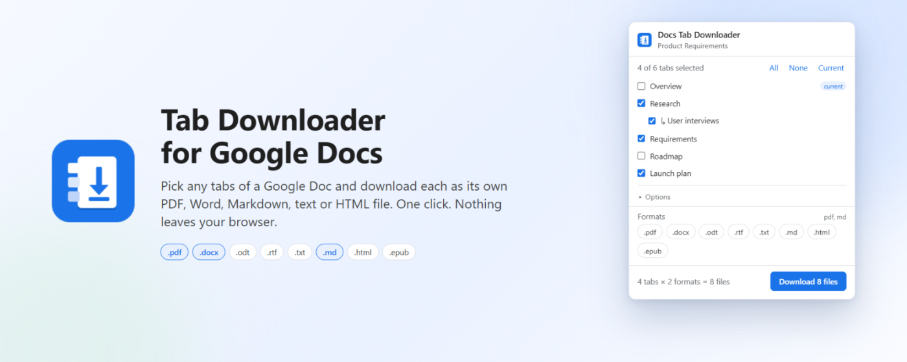

# Tab Downloader for Google Docs



A Chrome extension that downloads **individual document tabs** from a Google Doc
as separate files. Google's own *File → Download* only offers "current tab" or
"all tabs" — this lets you pick exactly the tabs you want, choose a format, name
the files sensibly, and optionally bundle them into one ZIP.

Works in Chrome, Brave, Edge and other Chromium browsers (Manifest V3).
Licensed under MIT.

## Features

- Lists every tab (and nested subtab) of the open document with checkboxes
- Formats: PDF, Word (.docx), OpenDocument (.odt), RTF, plain text, Markdown, HTML, EPUB —
  pick **several at once** and every selected tab is exported in each of them
- Each tab becomes its own file, named `Document – Tab.ext` (configurable)
- Nested tabs can be prefixed with their parent tab's name
- Optional: save everything into a folder named after the document
- Optional: bundle all selected tabs into a single `.zip`
- Downloads keep running even if you close the popup
- No accounts, no OAuth, no servers — it uses the Google session you are already signed in with

## How it works

1. When you click the toolbar icon on a Google Docs page, the popup injects a
   tiny script (via `chrome.scripting`) that reads the document's tab list from
   the page DOM (`#chapter-container-{tabId}` elements). Nothing else on the page
   is touched.
2. For each selected tab the extension builds Google's export URL
   `https://docs.google.com/document/d/{docId}/export?format={fmt}&tab={tabId}`
   and hands it to `chrome.downloads`, which uses your existing Google cookies.
3. In ZIP mode the service worker fetches each export instead and packs the
   results with a small built-in ZIP writer (`zip.js`, store-only).

> The `tab=` export parameter is not officially documented by Google. It works
> today; if Google removes it the extension will need an update.

### Speed and Google's export quota

Measured (Sept 2026): Google's export endpoint allows roughly **6 exports in a
burst, then about one every 5 seconds, per document** — shared across every
format, the legacy `feeds/download` endpoint, and tab/no-tab requests. Two
mitigations are built in:

- **Adaptive pacer** (`background.js`): bursts, then settles at the cadence
  Google accepts, adjusting on further 429s, so no request is wasted and no
  item fails. The popup shows an ETA and explains the limit.
- **Merged fast path for Markdown and TXT**: the whole document is exported
  once (Google separates tabs with `# Title` / a `Title` line) and split
  locally, so 30 tabs cost one request. If the headings don't line up with
  the tab list it silently falls back to per-tab exports.

PDF/DOCX/ODT/RTF/EPUB/HTML cannot be split locally, so a 31-tab PDF download
takes ≈ 2 minutes no matter what; that is Google's limit, not the extension's.

## Install (development)

1. `chrome://extensions` → enable **Developer mode** (top-right)
2. **Load unpacked** → select this folder
3. Open any Google Doc that has tabs and click the extension icon

Icons are generated from code — regenerate with `node tools/make-icons.js`.

## Project layout

| File | Purpose |
| --- | --- |
| `manifest.json` | MV3 manifest |
| `popup.html/css/js` | The picker UI; also contains the injected DOM scraper |
| `background.js` | Service worker: download queue, progress, ZIP job |
| `zip.js` | Dependency-free ZIP (store) writer + base64 helper |
| `tools/make-icons.js` | Generates `icons/*.png` |
| `tools/build.js` | Builds the store package in `dist/` (strips dev-only bits) |
| `tools/serve.js` | Static server for rendering `marketing/` pages |
| `tools/finalize-assets.js` | Resamples captured PNGs to exact store sizes, builds the brochure PDF |
| `dev-bridge.js` | Dev-only postMessage bridge for automated popup testing (not shipped) |
| `marketing/` | HTML sources for screenshots, promo tiles and brochure; rendered files in `marketing/out/` |
| `STORE_LISTING.md` | Copy for the Chrome Web Store listing + permission justifications |
| `PUBLISHING.md` | Step-by-step Web Store submission guide |
| `PRIVACY.md` | Privacy policy (link it from the store listing) |
| `LINKEDIN_POST.md` | Launch post |

## Permissions

| Permission | Why |
| --- | --- |
| `scripting` | Read the tab list from the open Google Docs page |
| `downloads` | Save the exported files with proper names |
| `storage` | Remember your format / naming preferences |
| `host: docs.google.com` | Run the scraper on Docs pages and request exports |
| `host: *.googleusercontent.com` | Google 302-redirects every export to `doc-…-docstext.googleusercontent.com`; ZIP mode has to be allowed to follow it |

## Development & testing

The popup can be driven by automated tests when opened as
`popup.html?tab=<chromeTabId>` from a page on docs.google.com: `dev-bridge.js`
exposes a small postMessage API (`state`, `click`, `set`, `downloads`, `fetch`).
This requires the `web_accessible_resources` entry in the manifest, which
`tools/build.js` removes from the published package.

## Marketing assets

```
node tools/serve.js            # serves marketing/*.html on http://127.0.0.1:8765
# open each page, capture the stage, then:
node tools/finalize-assets.js marketing/out/manifest.json
```

Outputs in `marketing/out/`: four 1280×800 screenshots, 440×280 and 1400×560
promo tiles, `brochure.png` + `brochure.pdf`.

## Release

```
node tools/make-icons.js       # only if the icon changed
node tools/build.js            # -> dist/tab-downloader-for-google-docs-<version>.zip
```

Bump `version` in `manifest.json` before each upload. See `PUBLISHING.md`.
